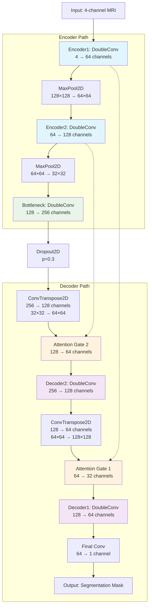

# Tumor Segmentation using Attention UNet

This project implements an Attention UNet architecture for brain tumor segmentation from MRI scans. The model combines the power of UNet with attention mechanisms to improve segmentation accuracy.

## Model Architecture

### Attention UNet Overview

The Attention UNet is an enhanced version of the traditional UNet that incorporates attention gates to focus on relevant features during the decoding process. This architecture is particularly effective for medical image segmentation tasks.

### Architecture Block Diagram

### Detailed Architecture Components

#### 1. Encoder Path (Contracting)
- **Encoder1**: DoubleConv block (4 → 64 channels)
  - Conv2D(4, 64, kernel=3×3, padding=1) + BatchNorm2D + ReLU
  - Conv2D(64, 64, kernel=3×3, padding=1) + BatchNorm2D + ReLU
  - MaxPool2D(2×2)

- **Encoder2**: DoubleConv block (64 → 128 channels)
  - Conv2D(64, 128, kernel=3×3, padding=1) + BatchNorm2D + ReLU
  - Conv2D(128, 128, kernel=3×3, padding=1) + BatchNorm2D + ReLU
  - MaxPool2D(2×2)

#### 2. Bottleneck
- **Bottleneck**: DoubleConv block (128 → 256 channels)
  - Conv2D(128, 256, kernel=3×3, padding=1) + BatchNorm2D + ReLU
  - Conv2D(256, 256, kernel=3×3, padding=1) + BatchNorm2D + ReLU
  - **Dropout2D(p=0.3)** for regularization

#### 3. Decoder Path (Expanding) with Attention Gates
- **Up2**: ConvTranspose2D(256, 128, kernel=2×2, stride=2)
- **Attention Gate 2**: 
  - Processes gating signal (128 channels) and local features (128 channels)
  - Outputs attention weights (64 channels)
- **Decoder2**: DoubleConv block (256 → 128 channels)
  - Concatenates upsampled features with attention-weighted encoder features

- **Up1**: ConvTranspose2D(128, 64, kernel=2×2, stride=2)
- **Attention Gate 1**:
  - Processes gating signal (64 channels) and local features (64 channels)
  - Outputs attention weights (32 channels)
- **Decoder1**: DoubleConv block (128 → 64 channels)
  - Concatenates upsampled features with attention-weighted encoder features

#### 4. Output Layer
- **Final Conv**: Conv2D(64, 1, kernel=1×1)
- **Output**: Single-channel segmentation mask

### Attention Mechanism

The attention gates use the following components:
- **W_g**: 1×1 convolution to process gating signal
- **W_x**: 1×1 convolution to process local features
- **ψ**: 1×1 convolution to generate attention weights
- **Sigmoid activation** to normalize attention weights

### Model Parameters

- **Input Channels**: 4 (multi-modal MRI: T1, T1c, T2, FLAIR)
- **Output Channels**: 1 (binary segmentation mask)
- **Feature Dimensions**: [64, 128, 256]
- **Total Parameters**: ~1.2M
- **Input Size**: 128×128 pixels
- **Output Size**: 128×128 pixels

### Key Features

1. **Attention Gates**: Focus on relevant features during decoding
2. **Skip Connections**: Preserve spatial information from encoder
3. **Double Convolutions**: Enhanced feature extraction
4. **Dropout Regularization**: Prevents overfitting
5. **Batch Normalization**: Stabilizes training

### Training Details

- **Loss Function**: Combined Dice Loss + Focal Loss
- **Optimizer**: Adam with learning rate 3e-5
- **Data Augmentation**: Albumentations library
- **Batch Size**: 8
- **Epochs**: 30

### Dataset

The model is trained on:
- **BraTS 2020**: Brain tumor segmentation challenge dataset
- **LIDC-IDRI**: Lung nodule dataset for transfer learning

This architecture demonstrates state-of-the-art performance in medical image segmentation tasks, particularly for brain tumor detection and segmentation.
